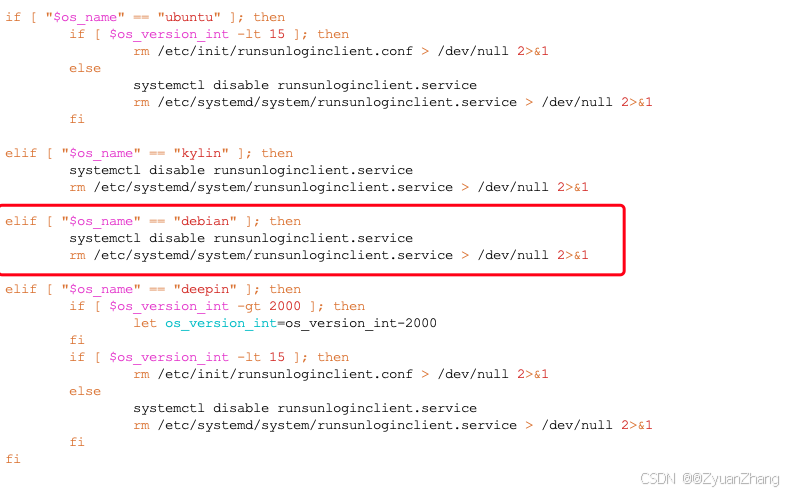

# sunlogin_for_debian
Modify the installation source code of Sunlogin for Debian. 
 
对向日葵的安装源码进行修改，使之能够在Debian上进行安装。

# 说明：
因为之前服务器上安装了 PVE (Proxmox VE)，之前是用 Proxmox VE 进行服务器资源管理的。出于某些原因，现在不再通过 PVE构建的虚拟机来使用计算资源，而是通过 PVE 自带的 Debian 系统直接使用虚拟机资源（因为积累的数据量比较多，重新装系统不太现实，而且部分虚拟机也在用，所以目前的形式就是：一方面通过虚拟机使用计算资源，另一方面直接通过 Debian 使用计算资源）。

为了能够远程连接服务器，需要在 Debian 上安装向日葵软件。去官网下载时可以发现，没有直接适用 Debian 的向日葵安装包，所以本文将通过修改向日葵安装包源码来实现向日葵在 Debian 上的安装。

# 1. 下载向日葵安装包：
从官网上下载个人版向日葵（https://sunlogin.oray.com/download/linux?type=personal） 因为是服务器端安装，所以选择命令行版本的向日葵。

下载方式：`wget https://dw.oray.com/sunlogin/linux/sunloginclientshell-10.1.1.28779-amd64.deb`

# 2. 解包并修改安装源码：
## 2.1 解包：
通过命令 `dpkg-deb -R sunloginclientshell-10.1.1.28779-amd64.deb sunloginclient` 将下载的 `.deb`安装包解压缩到 `sunloginclient` 目录下，该目录包含 `DEBIAN` 和 `usr` 两个子目录。

切换到`DEBIAN`目录下（`cd sunloginclient/DEBIAN`），可以看到有`control postinst  postrm  preinst  prerm` 四个文件，其中需要修改的是 `postinst` 和 `prerm` 两个文件。

## 2.2 修改：

**切换到`../usr/local/sunlogin/scripts/`（2.2.1-2.2.4都是该目录）**
### 2.2.1 修改`common.sh`文件：
切换到`scripts`目录下（`cd ../usr/local/sunlogin/scripts/`），用`vi`打开`common.sh`文件（如下图），可以发现其中是包含`debian`选项的（绿色箭头指示；但是后续安装脚本中没有`debian`相关内容，所以不能直接在`debian`上安装）。由于我们是要在 PVE 上安装，所以`/etc/issue`中所需的关键词是 "Proxmox Virtual Environment"，所以需要添加红框标注的部分。


第二处需要修改的是 `os_version` 部分，需要增加红框标注的内容（如下所示）。需要注意的是我这里是`/etc/issue.net`，需要根据具体情况修改目标文件（可以 `ls /etc/issue*` 看一下 `issue`相关的文件）。


### 2.2.2 修改 `start.sh`

需要修改的地方如下所示，增加一处 debian 的启动项（注意 `debian` 的大小写）。


### 2.2.3 修改 `depends.sh`

需要增加一项 `debian` 的判断项。


### 2.2.4 修改 `stop.sh`

需要增加一项 debian 的终止项（注意 `debian` 的大小写）。


### 2.2.5 修改 `postinst`
切换到 `DEBIAN/`目录下，有两处需要修改（红框所示）。


### 2.2.6 修改`prerm`
有一处修改。



## 2.3 打包：
运行`dpkg-deb -b sunloginclient/ sunlogincilent-10.1.1.128779-fixed-amd64.deb` 对 `sunloginclient/`目录进行打包。

## 2.4 安装：
运行`sudo dpkg -i sunlogincilent-10.1.1.128779-fixed-amd64.deb`进行安装，安装时可能会报错：`Package libncurses5 is not installed.`，可以通过`sudo apt-get install libncurses5-dev`安装`libncurses5`，可能还会报错：`E: Unmet dependencies. Try 'apt --fix-broken install' with no packages (or specify a solution).`，可以通过`apt --fix-broken install`进行处理。

# 3. 运行向日葵：
运行`sudo /usr/local/sunlogin/bin/sunloginclient`

出现：


按`f12`登入向日葵账户即可：


登入之后：


再按f12退出（exit）即可。

# 4. 向日葵远程登入并创建新用户名：
## 4.1 创建用户组：
```shell
sudo groupadd zhang_group
sudo groupadd wang_group
```
## 4.2 创建新用户：
```shell
sudo useradd -m -G zhang_group zhangsan
sudo useradd -m -G wang_group wangwu

## 查看zhangsan 和 wangwu的用户组
groups zhangsan
groups wangwu
```

## 4.3  设置密码：
```shell
sudo passwd zhangsan

sudo passwd wangwu
```

修改`/ect/passwd`，将新用户对应行的 `xxx:/bin/sh`换成`xxx:/bin/bash`

**（ps. 新建用户没有 sudo 权限）**
## 4.4 赋予 sudo 权限：
将用户加入到 sudo 组即可：`sudo usermod -aG sudo 用户名`（前提是切换到有 sudo 权限的用户在执行此操作）。

验证：运行`sudo whoami` 返回 `root` 即可；也可以通过 `groups 用户名`，输出包含 `sudo` 即可。

**去掉 sudo 权限：运行 `sudo deluser 用户名 sudo` 即可。**

# 参考：
[1]. https://forums.debiancn.org/t/topic/2801

[2]. https://sunlogin.oray.com/download/linux?type=personal


